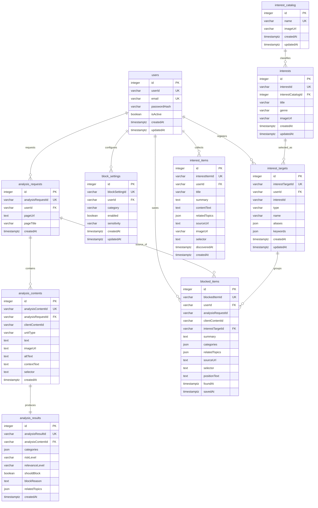

# ERD

```mermaid
erDiagram
    users {
        integer id PK
        varchar userId UK
        varchar email UK
        varchar passwordHash
        boolean isActive
        timestamptz createdAt
        timestamptz updatedAt
    }

    interest_catalog {
        integer id PK
        varchar name UK
        varchar imageUrl
        timestamptz createdAt
        timestamptz updatedAt
    }

    interests {
        integer id PK
        varchar interestId UK
        integer interestCatalogId FK
        varchar title
        varchar genre
        varchar imageUrl
        timestamptz createdAt
        timestamptz updatedAt
    }

    interest_targets {
        integer id PK
        varchar interestTargetId UK
        varchar userId FK
        varchar interestId
        varchar type
        varchar name
        json aliases
        json keywords
        timestamptz createdAt
        timestamptz updatedAt
    }

    block_settings {
        integer id PK
        varchar blockSettingId UK
        varchar userId FK
        varchar category
        boolean enabled
        varchar sensitivity
        timestamptz createdAt
        timestamptz updatedAt
    }

    analysis_requests {
        integer id PK
        varchar analysisRequestId UK
        varchar userId FK
        text pageUrl
        varchar pageTitle
        timestamptz createdAt
    }

    analysis_contents {
        integer id PK
        varchar analysisContentId UK
        varchar analysisRequestId FK
        varchar clientContentId
        varchar unitType
        text text
        text imageUrl
        text altText
        text contextText
        text selector
        timestamptz createdAt
    }

    analysis_results {
        integer id PK
        varchar analysisResultId UK
        varchar analysisContentId FK
        json categories
        varchar riskLevel
        varchar relevanceLevel
        boolean shouldBlock
        text blockReason
        json relatedTopics
        timestamptz createdAt
    }

    blocked_items {
        integer id PK
        varchar blockedItemId UK
        varchar userId FK
        varchar analysisRequestId
        varchar clientContentId
        varchar interestTargetId FK
        text summary
        json categories
        json relatedTopics
        text sourceUrl
        text selector
        text positionText
        timestamptz foundAt
        timestamptz savedAt
    }

    interest_items {
        integer id PK
        varchar interestItemId UK
        varchar userId FK
        varchar title
        text summary
        text contentText
        json relatedTopics
        text sourceUrl
        varchar imageUrl
        text selector
        timestamptz discoveredAt
        timestamptz createdAt
    }

    users ||--o{ interest_targets : registers
    users ||--o{ block_settings : configures
    users ||--o{ analysis_requests : requests
    users ||--o{ blocked_items : saves
    users ||--o{ interest_items : collects

    interest_catalog ||--o{ interests : classifies
    interests ||--o{ interest_targets : selected_as

    analysis_requests ||--o{ analysis_contents : contains
    analysis_contents ||--|| analysis_results : produces
    analysis_requests ||--o{ blocked_items : source_of
    interest_targets ||--o{ blocked_items : groups
```
