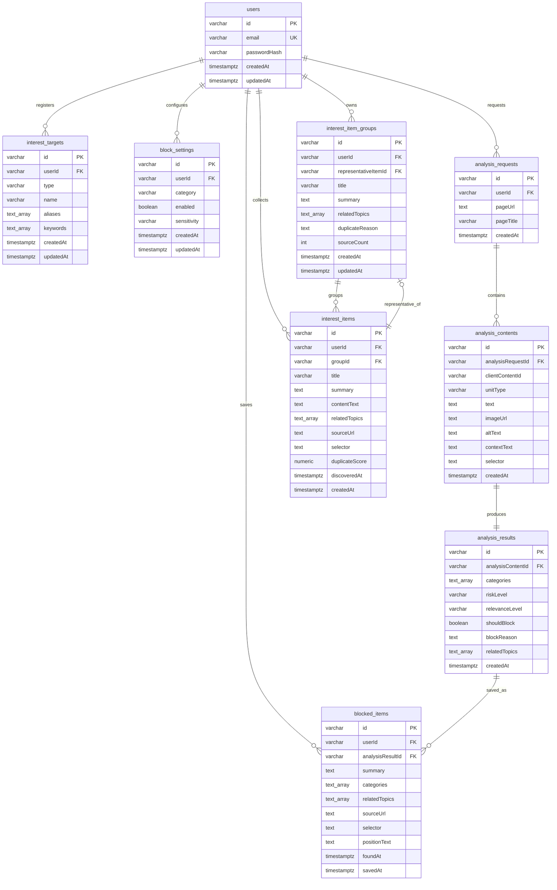

# ERD

```mermaid
erDiagram
    users {
        varchar id PK
        varchar email UK
        varchar passwordHash
        timestamptz createdAt
        timestamptz updatedAt
    }

    interest_targets {
        varchar id PK
        varchar userId FK
        varchar type
        varchar name
        text_array aliases
        text_array keywords
        timestamptz createdAt
        timestamptz updatedAt
    }

    block_settings {
        varchar id PK
        varchar userId FK
        varchar category
        boolean enabled
        varchar sensitivity
        timestamptz createdAt
        timestamptz updatedAt
    }

    analysis_requests {
        varchar id PK
        varchar userId FK
        text pageUrl
        varchar pageTitle
        timestamptz createdAt
    }

    analysis_contents {
        varchar id PK
        varchar analysisRequestId FK
        varchar clientContentId
        varchar unitType
        text text
        text imageUrl
        text altText
        text contextText
        text selector
        timestamptz createdAt
    }

    analysis_results {
        varchar id PK
        varchar analysisContentId FK
        text_array categories
        varchar riskLevel
        varchar relevanceLevel
        boolean shouldBlock
        text blockReason
        text_array relatedTopics
        timestamptz createdAt
    }

    blocked_items {
        varchar id PK
        varchar userId FK
        varchar analysisResultId FK
        text summary
        text_array categories
        text_array relatedTopics
        text sourceUrl
        text selector
        text positionText
        timestamptz foundAt
        timestamptz savedAt
    }

    interest_item_groups {
        varchar id PK
        varchar userId FK
        varchar representativeItemId FK
        varchar title
        text summary
        text_array relatedTopics
        text duplicateReason
        int sourceCount
        timestamptz createdAt
        timestamptz updatedAt
    }

    interest_items {
        varchar id PK
        varchar userId FK
        varchar groupId FK
        varchar title
        text summary
        text contentText
        text_array relatedTopics
        text sourceUrl
        text selector
        numeric duplicateScore
        timestamptz discoveredAt
        timestamptz createdAt
    }

    users ||--o{ interest_targets : registers
    users ||--o{ block_settings : configures
    users ||--o{ analysis_requests : requests
    users ||--o{ blocked_items : saves
    users ||--o{ interest_item_groups : owns
    users ||--o{ interest_items : collects

    analysis_requests ||--o{ analysis_contents : contains
    analysis_contents ||--|| analysis_results : produces
    analysis_results ||--o{ blocked_items : saved_as

    interest_item_groups ||--o{ interest_items : groups
    interest_items ||--o| interest_item_groups : representative_of
```
